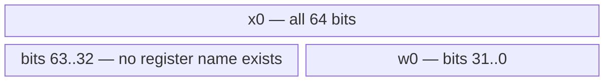
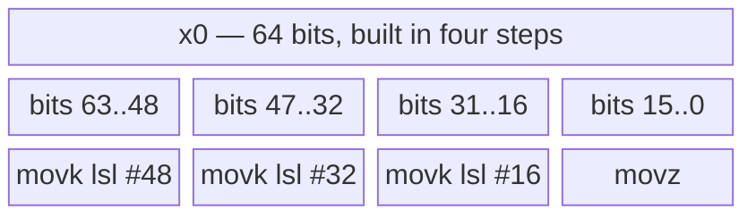
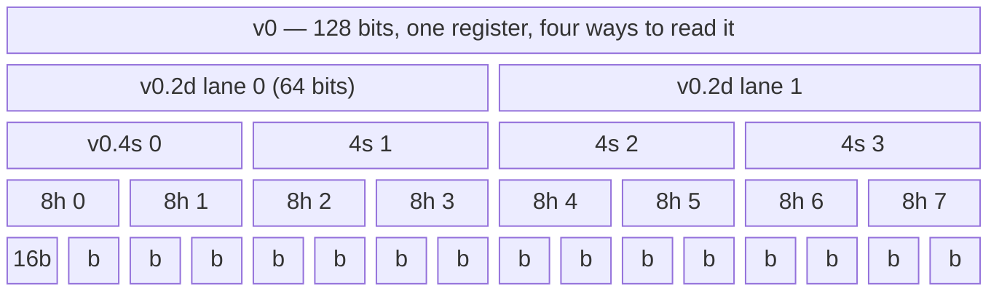
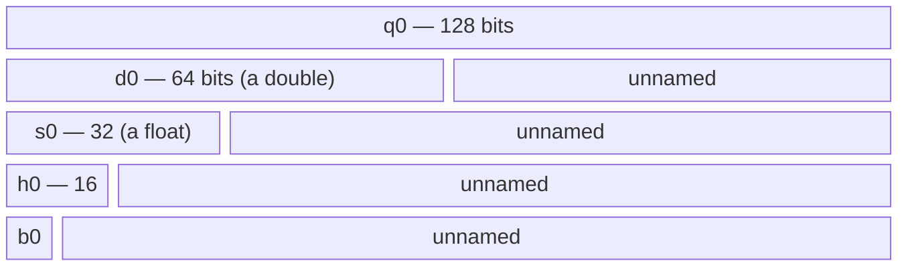
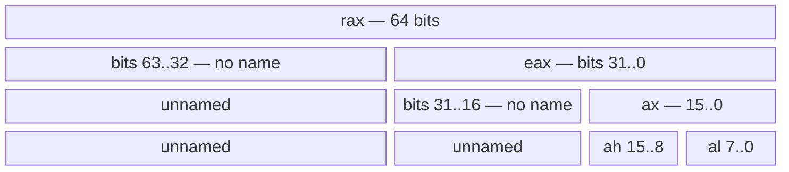

# How a 64-bit register divides up

Run the demonstration first — every number below came from it:

```sh
cd 00-instruction-set && make run
```

## 1. AArch64: there are only two integer views, and no name for the top half



```
 63                             32 31                              0
+---------------------------------+---------------------------------+
|                                 |                                 |
+---------------------------------+---------------------------------+
|<--------- no name for this ---->|<------------- w0 -------------->|
|<---------------------------- x0 ---------------------------------->|
```

`x0` and `w0` are **the same register**, not two registers. `w0` is a *view* of
the low half. There is no `w0_high`, no `x0.hi`, nothing — if you want bits
63..32 you must shift them down:

```
mov x0, x1          0x1122334455667788   the whole 64 bits
mov w0, w1          0x0000000055667788   low 32 kept, HIGH 32 ZEROED
lsr x0, x1, #32     0x0000000011223344   the only way to reach the high half
```

### The rule that falls out of this

**Writing a `w` register zeroes bits 63..32.** Always, architecturally, not as an
optimisation. Three consequences you meet constantly in this repo:

- **Narrowing is free.** `(int)someLong` emits no instruction, because `w0`
  already *is* the low half ([chapter 00 §8](../00-instruction-set/note.md)).
- **Zero-extending 32→64 is also free.** `mov w0, w0` does it as a side effect,
  so `(unsigned long)someUnsigned` costs nothing either. Only *sign*-extension
  needs a real instruction, `sxtw`.
- **There are no partial-register hazards.** Compare with x86-64 below.

## 2. Where 16-bit granularity actually comes from on AArch64

There is no `ax`, no `al`, no 16-bit register name at all. Sub-32-bit access
comes from three other places instead.

### (a) Building constants: four 16-bit slots

An instruction is 32 bits wide, so a 64-bit constant is assembled 16 bits at a
time — this is why `movk` exists ([chapter 00 §3](../00-instruction-set/note.md)):



```
                               63..48 47..32 31..16 15..0
movz x0, #0x7788               0000   0000   0000   7788    slot 0 written, rest ZEROED
movk x0, #0x5566, lsl #16      0000   0000   5566   7788    slot 1 written, slot 0 untouched
movk x0, #0x3344, lsl #32      0000   3344   5566   7788    slot 2 written, slots 0-1 untouched
movk x0, #0x1122, lsl #48      1122   3344   5566   7788    slot 3 written, rest untouched
```

### Careful: that `lsl` does not shift `x0`

This is the most misread line in the whole reference, so it is worth being blunt
about it. **The `lsl #16` applies to the 16-bit immediate, not to the destination
register.** Nothing already in `x0` moves — notice `7788` sitting in the bottom
slot, unchanged, through all four instructions.

If `lsl #16` really shifted `x0`, the second instruction would have pushed `7788`
up to bits 31..16 and produced `0x77885566`. It produces `0x55667788` instead:
the *new* value lands high and the old value stays low. That is what makes it look
as though the shift ran the other way. Compare with a genuine left shift:

```
movk x0, #0x5566, lsl #16      0000 0000 5566 7788    x0's old content stays put
lsl  x0, x0, #16               0000 0000 7788 0000    x0's content MOVES up
```

The accurate mental model is a masked field write:

```c
x0 = (x0 & ~(0xFFFFULL << N)) | ((uint64_t)imm << N);   /* the << applies to imm */
```

And the decisive evidence that it is not a shift operation at all — the assembler
only accepts four values, because the field is **2 bits wide** and selects one of
four slots:

```
movk x0, #0x1122, lsl #0    ACCEPTED        movk x0, #0x1122, lsl #8    REJECTED
movk x0, #0x1122, lsl #16   ACCEPTED        movk x0, #0x1122, lsl #40   REJECTED
movk x0, #0x1122, lsl #32   ACCEPTED
movk x0, #0x1122, lsl #48   ACCEPTED
```

A real shift accepts 0–63. `movk`'s `lsl` is a **slot selector wearing shift
syntax** — ARM reuses the notation because for `movz` the two readings happen to
coincide. Run `make run` in `00-instruction-set` for the live trace.

### (b) Memory: the *load* carries the width and the signedness

```
value in x1:        0x1122334455667788
ldrh  w0, [x1]      0x0000000000007788   16-bit load, zero-extended
ldrb  w0, [x1]      0x0000000000000088    8-bit load

value in x1:        0x1122334455668899   (low halfword 0x8899)
ldrh  w0, [x1]      0x0000000000008899   zero-extended: top bit ignored
ldrsh x0, [x1]      0xffffffffffff8899   SIGN-extended: top bit replicated
```

So `short`, `char` and `_Bool` are not register widths — they are *load widths*.
The register is always 32 or 64 bits; the type decides which load instruction
fetches it and whether the spare bits get 0s or copies of the sign bit.

### (c) Vector registers, where the sub-widths are named

The 128-bit vector file is the one place arm64 does give you nested names, and
lane arrangements for viewing the same bits at four granularities:



And the **scalar** floating-point names nest from the low end, exactly like the
integer `x`/`w` pair but with five levels:



```
 127                 64 63      32 31  16 15 8 7  0
+----------------------+----------+------+----+----+
|                      |          |      |    | b0 |   8 bits
|                      |          |      |  h0     |  16 bits
|                      |          |    s0          |  32 bits  (float)
|                      |        d0                 |  64 bits  (double)
|                    q0 / v0                        | 128 bits  (vector)
+---------------------------------------------------+
```

This is why `fmov w0, s0` ([chapter 00 §12](../00-instruction-set/note.md)) is a
*move between files*, not a conversion: `s0` and `w0` are both 32 bits, so the
bits transfer unchanged. That is what a union type-pun compiles to.

## 3. x86-64: the nested pyramid you may be thinking of

If you learned registers on x86, this is the picture you have in mind — and it is
genuinely different:



```
 63                32 31        16 15     8 7      0
+--------------------+------------+--------+--------+
|                    |            |   ah   |   al   |
|                    |            |       ax        |
|                    |           eax                |
|                   rax                             |
+---------------------------------------------------+
```

Four named views instead of two, plus `ah` reaching *into the middle* of the
register — the one case where a name does not start at bit 0.

### The trap x86 has and arm64 does not

The zeroing rule is inconsistent on x86-64, and that inconsistency is a real
performance hazard:

| Write | Bits 63..32 | Bits 31..16 |
|---|---|---|
| `mov rax, …` | written | written |
| `mov eax, …` | **zeroed** | written |
| `mov ax, …` | preserved | preserved |
| `mov al, …` | preserved | preserved |

Writing `eax` zeroes the top half (same as arm64's `w`), but writing `ax` or `al`
**merges** into the existing value. So `al` depends on whatever was in `rax`
before, which creates a false dependency the CPU cannot see through — the classic
*partial register stall*. It is why compilers emit `movzx eax, byte ptr [rdi]`
rather than `mov al, [rdi]`, and why `xor eax, eax` is the idiomatic way to zero a
register.

AArch64 avoided the whole category by having only two views and making the
narrow one always zero the rest.

## 4. Summary

| | AArch64 | x86-64 |
|---|---|---|
| 64-bit | `x0` | `rax` |
| 32-bit | `w0` | `eax` |
| 16-bit | **no name** — use `ldrh`/`strh` | `ax` |
| 8-bit | **no name** — use `ldrb`/`strb` | `al` (and `ah` for bits 15..8) |
| upper 32 bits | **no name** — use `lsr #32` | **no name** — use a shift |
| narrow write | always zeroes the rest | `eax` zeroes; `ax`/`al` merge |

The thing worth carrying away: on both machines **the upper half of a 64-bit
register has no name.** Registers are named from bit 0 upward, because that is
what arithmetic needs. Reaching high bits is always an explicit shift, mask or
vector-lane operation — which is exactly why chapter 04's bitfields compile to
`ubfx`/`bfi` and not to some addressing trick.
